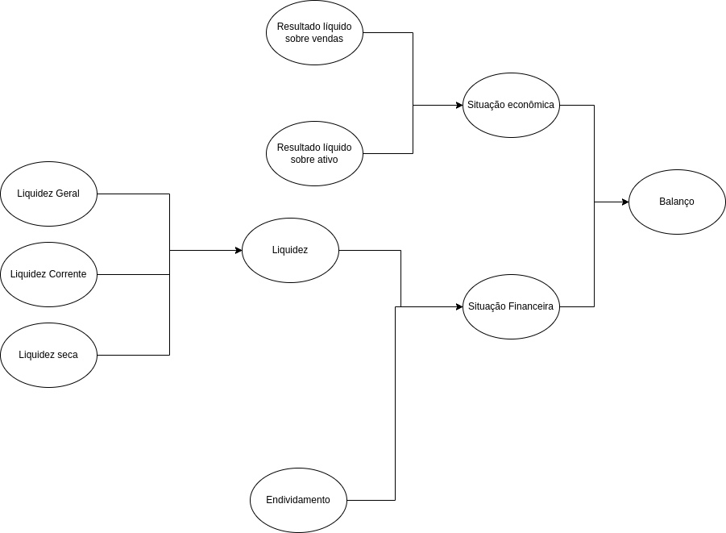

# Exercícios completos

### Questão 1)

```pl
% fatos
especie(joao, passaro).
especie(pedro, peixe).
especie(maria, minhoca).
especie(eu, humano).
especie(chuck_norris, gato).

gosta_de(passaro, minhoca).
gosta_de(gato, peixe).
gosta_de(gato, passaro).

gosta_de(chuck_norris, eu).
gosta_de(eu,chuck_norris).

% Regras
% Amigos gostam uns dos outros:
amigo(X,Y) :- gosta_de(Y,X), gosta_de(X,Y).

% O meu gato come tudo que gosta, exceto pessoas.
come(gato, X) :- gosta_de(gato, X), not(especie(X,humano)).

```

Nisso, podemos testar no interpretador o seguinte para ver se as regras funcionam:

```pl
?- come(gato,eu).
false.

?- come(gato,peixe).
true.

?- amigo(chuck_norris,eu).
true.

?- amigo(eu,chuck_norris).
true.
```

### Questão 2)

**a)** A regra é: `aluno_de(X,Y) :- aluno(X,Z), professor(Y,Z).`

Abaixo, temos os alunos em X, e os professores em Y. O exercício pediu os professores de X, mas eu só mudei a variável.

```
?- aluno_de(X,Y).
X = joao,
Y = carlos ;
X = maria,
Y = carlos ;
X = joel,
Y = pedro ;
X = joel,
Y = ana_paula.
```

**b)** A regra é: `associado_a(X,Y) :- frequenta(X,Y); funcionario(X,Y).`

Abaixo, em X temos os alunos e funcionários e em Y as faculdades. Aqui, novamente, mudei somente a notação.

```pl
?- associado_a(X,puc).
X = joao ;
X = maria ;
X = ana_paula ;
X = carlos.
```

### Questão 3)

Acredito que essa questão esteja ambígua em relação à notação normal do Prolog. Porém, vou assumir que `x,y,z` são variáveis, que de acordo com a definição do Prologo deveriam ser em letras maiúsculas, `P,Q` predicados.

Para o primeiro par de sentenças:
`P(A,B,B), P(x,y,z)`

Podendo ele ser escrito assim em Prolog: `p(X,Y,Z) = p(a,b,b).`

Nesse caso, há a seguinte unificação:

```
X = a,
Y = Z, Z = b.
```

Ou seja, na notação do exercício, `A` unifica com `x` e `z` unifica com `y` que unifica com `B`.

Para a segunda sentença: `P(x,y), Q(A,B)`.

Nesse caso, não há unificador geral, porque os predicados P e Q são diferentes.

Para a terceira sentença: `Q(y,G(A,B)), Q(G(x,z),y)`

Nesse caso, é possível fazer as seguintes unificações (seguindo a notação do exercício):

```
y = G(A,B),
x = A,
z = B
```

Para a última sentença: `P(f(x),y,g(B)), P(f(y),A,z)`

A seguinte unificação é a mais geral:

```
x = y,
y = a,
z = g(a)

```

### Questão 5)

CATÁLOGO DE FILMES:

| Título     | Gênero   | Diretor   | Ano  | Min. |
| ---------- | -------- | --------- | ---- | ---- |
| Amnésia    | Suspense | Nolan     | 2000 | 113  |
| Babel      | Drama    | Iñarritu  | 2006 | 142  |
| Capote     | Drama    | Miller    | 2005 | 98   |
| Casablanca | Romance  | Curtiz    | 1942 | 102  |
| Matrix     | Ficção   | Wachowski | 1999 | 136  |
| Rebecca    | Suspense | Hitchcock | 1940 | 130  |
| Shrek      | Aventura | Adamson   | 2001 | 90   |
| Sinais     | Ficção   | Shyamalan | 2002 | 106  |
| Spartacus  | Ação     | Kubrick   | 1960 | 184  |
| Superman   | Aventura | Donner    | 1978 | 143  |
| Titanic    | Romance  | Cameron   | 1997 | 194  |
| Tubarão    | Suspense | Spielberg | 1975 | 124  |
| Volver     | Drama    | Almodóvar | 2006 | 121  |

Representação em Prolog:

```pl
movie('Amnésia', 'Suspense', 'Nolan', 2000, 113).
movie('Babel', 'Drama', 'Iñarritu', 2006, 142).
movie('Capote', 'Drama', 'Miller', 2005, 98).
movie('Casablanca', 'Romance', 'Curtiz', 1942, 102).
movie('Matrix', 'Ficção', 'Wachowski', 1999, 136).
movie('Rebecca', 'Suspense', 'Hitchcock', 1940, 130).
movie('Shrek', 'Aventura', 'Adamson', 2001, 90).
movie('Sinais', 'Ficção', 'Shyamalan', 2002, 106).
movie('Spartacus', 'Ação', 'Kubrick', 1960, 184).
movie('Superman', 'Aventura', 'Donner', 1978, 143).
movie('Titanic', 'Romance', 'Cameron', 1997, 194).
movie('Tubarão', 'Suspense', 'Spielberg', 1975, 124).
movie('Volver', 'Drama', 'Almodóvar', 2006, 121).
```

### Questão 5.1)

**a)** Fiz uma regra geral para encontrar o nome dos diretores e com ela posso
encontrar o diretor do filme "Titanic":

```pl
find_director(MovieName,Director) :- movie(MovieName,_,Director,_,_).

# Exemplo de uso da regra:
?- find_director('Titanic', D).
D = 'Cameron'.

```

**b)** A seguinte regra pode ser usada para encontrar filmes de suspense:

```pl
find_by_genre(Genre, MovieName) :- movie(MovieName,Genre,_,_,_).

# a regra funcionando abaixo:
?- find_by_genre('Drama',M).
M = 'Babel' ;
M = 'Capote' ;
M = 'Volver'.

```

Ela também pode ser usada para encontrar qualquer gênero de filme.

**c)** Usando a mesma regra do item **a)**:

```pl
?- find_director(M, 'Donner').
M = 'Superman'.
```

**d)** Fiz uma função mais completa para pegar todos os detalhes necessário de um filme:

```pl

find_movie_details(MovieName, Genre, Director, Year, Duration) :-
    movie(MovieName, Genre, Director, Year, Duration).

# resposta:

?- find_movie_details('Sinais',_,_,A,_).
A = 2002.
```

**e)** A seguinte função filtra os filmes por duração:

```pl


duration_less_than(Time,Name) :-
    movie(Name,_,_,_,Duration),
    Duration =< Time.

# aplicando a função:

?- duration_less_than(100,X).
X = 'Capote' ;
X = 'Shrek' ;
```

### Questão 5.2)

```pl

classico(Name):-
    movie(Name,_,_,Y,_),
    Y =< 1980.

# aplicando a regra na base de conhecimento:
?- classico(X).
X = 'Casablanca' ;
X = 'Rebecca' ;
X = 'Spartacus' ;
X = 'Superman' ;
X = 'Tubarão' ;
```

### Questão 5.3)

```pl

genero(Name,G):-
    movie(Name,Fg,_,_,_),
    G = Fg.

# o predicado aplicado:

?- genero(X,'Drama').
X = 'Babel' ;
X = 'Capote' ;
X = 'Volver'.

```

### questão 5.4)

```
# aplicando as duas regras em conjunto:

?- genero(X,'Suspense'), classico(X).
X = 'Rebecca' ;
X = 'Tubarão' ;
```

## Exercícios de sistemas especialistas

### Questão 1)

Primeiro, vou passar a base de conhecimento aqui, para ter uma leitura facilitada
para a prática do exercício:

```

Regra 1
SE prato principal tem molho
E tipo de molho é apimentado
ENTÃO Corpo recomendado = Encorpado

Regra 2
SE prato principal tem sabor delicado
ENTÃO Corpo recomendado = Leve

Regra 3
SE prato principal não tem molho
ENTÃO Corpo recomendado = Encorpado

Regra 4
SE prato principal tem molho
E tipo de molho é tomate
E preferência do host é leve
ENTÃO Corpo recomendado = Leve

Regra 5
SE prato principal tem molho
E tipo de molho é tomate
E preferência do host é encorpado
ENTÃO Corpo recomendado = Encorpado

Regra 6
SE carne do prato principal é peixe
ENTÃO cor recomendada é branco

Regra 7
SE carne do prato principal é carne vermelha
ENTÃO cor recomendada é tinto

Regra 8
SE carne do prato principal é ave ou carneiro E preferência do host é tinto
ENTÃO cor recomendada é tinto ou rose

Regra 9
SE carne do prato principal é ave ou carneiro E preferência do host é branco
ENTÃO cor recomendada é branco ou rose

Regra 10
SE prato principal não tem carne
E prato principal é massa
E o molho é tomate
ENTÃO cor recomendada é tinto

Regra 11
SE prato principal não tem carne
E prato principal é massa
E o molho é a base de queijo
ENTÃO cor recomendada é branco

Regra 12
SE corpo recomendado é leve
E cor recomendada é branco
ENTÃO vinho sugerido é Chenin Blanc ou Chardonay Jovem

Regra 13
SE corpo recomendado é leve
E cor recomendada é tinto
ENTÃO vinho sugerido é Berjoulais ou Carmenere

Regra 14
SE corpo recomendado é encorpado E cor recomendada é tinto
ENTÃO vinho sugerido é Cabernet ou Malbec

Regra 15
SE corpo recomendado é encorpado
E cor recomendada é branco
ENTÃO vinho sugerido é Riesling ou Chardonay Maduro

Regra 16
SE corpo recomendado é leve
E cor recomendada é rose
ENTÃO vinho sugerido é Rose frizante ou Espumante Rose

Regra 17
SE corpo recomendado é encorpado E cor recomendada é rose
ENTÃO vinho sugerido é Rose não frizante

# criada à partir de:
# Para sabores delicados ou molhos a base de queijo,
# o vinho deve ser leve.
Regra 18
SE molho à base de queijo
ENTÂO Corpo recomendado = leve

Regra 19
Se preferência do host é branco
ENTÃO cor recomendada é branco

# uma recomendação e uma preferência podem dar no mesmo resultado
# Essa regra é criada à partir da regra 14
Regra 20
SE preferência de corpo é encorpado E cor recomendada é tinto
ENTÃO vinho sugerido é Cabernet ou Malbec

Regra 21
SE preferência de corpo é encorpado E preferência da cor é tinto
ENTÃO vinho sugerido é Cabernet ou Malbec


```

Usando essas regras, posso aplicá-las nos cenários.

Tirando do material de estudo, eu peguei as entrevistas com o especialista
para tirar mais algumas regras:

Primeira entrevista:

> A escolha do vinho deve refletir o prato principal que será
> servido. Por exemplo, carnes vermelhas como carne bovina em geral pedem o acompanhamento de vinho tinto, enquanto que carnes brancas, como peixes, pedem vinho branco. Por outros lado, algumas exceções são a carne de
> carneiro e as aves, que podem ser acompanhadas por vinho rose, ou ainda a cor que for a preferencia dos participantes da refeição. O corpo do vinho
> também é uma característica importante, pois temos vinhos leves e outros
> encorpados. Dentre vinhos tintos e encorpados temos o Cabernet ou Malbec, enquanto que vinhos brancos e leves são os Chenin Blanc ou Chardonay Jovem. Por outro lado, o Riesling ou o Chardonay Maduro são vinhos brancos
> encorpados. Os vinhos rosé podem ser Espumante rosé ou Rosé não frizante, sendo os primeiros mais leves e os outros mais encorpados.

Segunda entrevista:

> O corpo do vinho deve ser definido de acordo com o molho que acompanha a carne ou
> massa (para casos sem carne). Se o molho é apimentado ou se não tem molho de acompanhamento, o vinho deve ser encorpado. Para sabores delicados ou molhos a base de queijo, o vinho deve ser leve. Por outro lado, se o molho for de tomate, o corpo pode ser de acordo com a preferência dos convidados. Se o prato é uma massa sem acompanhamento de carne, a cor do vinho deve ser tinto para molho de tomate e banco para molho a base de queijo. Dentre
> vinhos tintos e leves temos o Berjoulais e o Carmenere.

Com base nisso, adicionei a regra 18 em diante, se houverem mais.

**b.1)**
Aplicando primeiro, usando inferência com encadeamento progressivo.

**Cenário 1: Refeição carne bovina, molho à base de queijo, preferencia cor branco,
preferencia corpo encorpado.**

Enumerando os conhecimentos desse cenário, à seguir:

1. Refeição à carne bovina;
2. tem molho;
3. Molho à base de queijo;
4. preferência por vinhos brancos;
5. preferência de corpo encorpado;

A execução progressiva fica assim:

- Carne vermelha -> R7 -> necessário: cor recomendada é tinto;
-

até aqui, o vinho poderia ser tinto e o corpo seria leve,
resultado na seleção de vinhos da regra 13: Berjoulais ou Carmenere.

Porém, as próximas duas informações complicam. Como a preferência é por vinhos brancos, e diz-se na entrevista que "carnes vermelhas como carne bovina em geral pedem o acompanhamento de vinho tinto", não conseguiremos mais casar nenhuma regra, pois a carne vermelha resulta em vinhos tintos. Porém, como na entrevista está dito que é "em geral", talvez podemos assumir que isso pode ser mudado pela preferência de quem vai fazer a refeição?

Se não tiver mais nenhuma regra, nada se pode assumir com a regra 4 apenas. E nem com a regra 5. Pois não há regras que definam vinhos brancos. Na verdade, esse cenário é até o oposto do que o sistema sugeriria caso usasse as regras definidas (tino e corpo leve, seria o opsto de branco encorpado).

Se criarmos uma regra, onde o host pode simplesmente usar a sua preferência, da seguinte maneira:

```
Regra 19
Se preferência do host é branco
ENTÃO cor recomendada é branco
```

Essa regra corroboraria com as péssimas escolhas de vinho do Host. O que daria em resultados ruins, apesar de chegar em alguma conclusão.

Acredito que essas informações na entrevista são insuficientes para concluir algo.

Vamos ver o cenário seguinte:

**Cenário 2: Refeição carne carneiro, molho apimentado, preferencia cor tinto, preferencia
corpo encorpado**

Enumerando os conhecimentos desse cenário, à seguir:

1. Refeição de carne de carneiro;
2. tem molho;
3. Molho apimentado;
4. preferência por tinto;
5. preferência de corpo encorpado;

- carne de carneiro -> R8 -> fatos: cor tinto ou rosê;
- molho apimentado -> R1 -> fato: corpo encorpado recomendado;
- encorpado e tinto -> R14.
- Vinhos sugeridos: Cabernet ou Malbec.

Vinos sugeridos são Cabernet ou Malbec.

**b.2)** Agora com encadeamento regressivo.

Apenas o cenário 2, dado que o 1 não daria certo:

- R14: SE corpo encorpado;
- corpo encorpado -> R1 -> fatos: molho apimentado E prato tem molho;
- O cenário satisfaz as condições da R1;
- cor recomenda é tinto -> R8 -> fatos: carne do prato principal é ave ou carneiro E preferência do host é tinto
- O cenário satisfaz as condições da R8;
- portanto, a R14 vale;
- vinhos sugeridos são Malbec ou Cabernet.

### Questão 2) Análise de Balanço

> O principal caminho para se avaliar a "saúde de uma empresa é analisar os dados divulgados em seu último Balanço, onde é feita uma Demonstração dos Resultados da empresa durante o período compreendido pelo Balanço. São relatados números como: Patrimônio Líquido, Ativo Permanente, Faturamento, etc. Além da Demonstração de Resultados, são também divulgados Índices Fundamentalistas que servem de parâmetro para indicar a evolução da empresa. Uma das melhores formas de se fazer a análise de um balanço é comparar seus índices com índices padrões que podem ser divulgados por setor, subsetor ou área de atividade. Dependendo da natureza do índice que se está analisando, pode ser um dado favorável ou desfavorável, a empresa ter um índice superior ao índice padrão. Assim, podemos dividir os índices em 2 grupos: Crescentes, quanto maior melhor e Decrescentes, quanto menor melhor. Podemos citar como índices Crescentes:Liquidez Seca, Liquidez Geral, Liquidez Corrente, Resultado Líquido Sobre Vendas e Resultado Líquido Sobre o Ativo. Índice Decrescente: Nível de Endividamento.

```
# Regra 1
SE índice crescente é alto
ENTÃO empresa saudável
SE índice decrescente é baixo
ENTÃO empresa saudável

# Regra 2
SE índice é Liquidez Seca, Liquidez Geral, Liquidez Corrente, Resultado líquido sobre vendas, resultado líqudo sobre ativo;
ENTÂO é um índice crescente;

# Regra 3
SE índice é nível de endividamento
ENTÃO é um índice decrescente;

```

Próximo parágrafo

> Inicialmente, cada índice pode ser classificado em algum dos conceitos: Péssimo,Regular, Bom e Ótimo. Para isto, eles são comparados com suas respectivas tabelas de Índices Padrões. Nestas tabelas, para cada índice são dados 3 patamares padrões: o Patamar 1, o Patamar 2 e o Patamar 3. Para se classificar cada índice verifica-se em qual faixa ele se encaixa. Por exemplo: entre o Patamar 2 e o Patamar 3 ou abaixo do Patamar 1. De acordo com a sua faixa e sua natureza, o conceito é obtido. Uma vez classificado cada um dos índices em separado é necessário que se relacione todos eles para se chegar a um conceito final do Balanço, que poderá ser: Favorável, Desfavorável ou Neutro. O conceito final do Balanço é obtido a partir da Análise da Situação Financeira e da Situação Econômica da Empresa. Se ambas forem Ótimas ou se uma for Ótima e a outra for Boa ou Regular, o Balanço será considerado Favorável. Se uma for Regular e a Outra for Regular o Balanço é considerado Neutro. Em outros casos o Balanço é considerado Desfavorável.

Tabela de critérios:

| Situação econômica | Situação financeira | Balanço      |
| ------------------ | ------------------- | ------------ |
| Ótima              | Ótima               | Favorável    |
| Ótima              | Boa                 | Favorável    |
| Boa                | Ótima               | Favorável    |
| Regular            | Ótima               | Favorável    |
| Ótima              | Regular             | Favorável    |
| Regular            | Regular             | Neutro       |
| Regular            | \_                  | Desfavorável |
| \_                 | Regular             | Desfavorável |
| \_                 | \_                  | Desfavorável |

> Para se chegar à Situação Econômica, utiliza-se os índices Resultado Líquido Sobre Vendas e Resultado Líquido Sobre o Ativo. Se um deles for Ótimo e o outro for pelo menos Regular, a Situação Econômica é considerada Ótima. Se um deles for Bom e o outro Bom ou Regular, a Situação Econômica (**observação, aqui no material está escrito situação Financeira. Mas pelo contexto, achamos que se trata da situação econômica por causa do uso da palavra Bom no lugar de Alta)** é considerada Boa. Se um deles for Péssimo e o outro Péssimo ou Regular a Situação Econômica é considerada Péssima. Dentre os índices que expressam a Liquidez, o mais importante é a Liquidez Geral. Por isso basta que ela seja Ótima e/ou a Liquidez Corrente ou a Liquidez Seca pelo menos Regular que a Liquidez será considerada Alta. Se a Liquidez Geral for Boa, tanto a Liquidez Seca como a Liquidez Corrente devem ser pelo menos Boas para que a Liquidez seja considerada Alta. Se a Liquidez Geral for Boa e as outras forem Regular ou Ruim, a Liquidez será considerada Neutra. Nos Outros casos a Liquidez será considerada Baixa.

Tabela de critérios para a situação econômica:

| Resultado líquido sobre vendas | Resultado líquido sobre o ativo | Situação Econômica |
| ------------------------------ | ------------------------------- | ------------------ |
| Ótimo                          | Regular                         | Ótimo              |
| Ótimo                          | Ótimo                           | Ótimo              |
| Ótimo                          | Bom                             | Ótimo              |
| Bom                            | Bom                             | Boa                |
| Bom                            | Regular                         | Boa                |
| Regular                        | Bom                             | Boa                |
| Péssimo                        | Péssimo                         | Péssima            |
| Péssimo                        | Regular                         | Péssima            |
| Regular                        | Péssimo                         | Péssima            |

Tabela de critérios para a liquidez:

| Geral | Corrente  | Seca      | Liquidez |
| ----- | --------- | --------- | -------- |
| Ótima | > Regular | > Regular | Alta     |
| Boa   | Regular   | Ruim      | Neutra   |
| Boa   | Ruim      | Regular   | Neutra   |
| \_    | \_        | \_        | Baixa    |

Próximo parágrafo

> Se a Liquidez for Alta e o Nível de Endividamento Ótimo, a Situação Financeira será Ótima. Se a Liquidez for Neutra e o Nível de Endividamento Ótimo ou a Liquidez for Alta e o Nível de Endividamento Bom, a Situação Financeira será Boa. Se a Liquidez for Baixa e o Nível de Endividamento Péssimo a Situação Financeira é considerada Péssima. Nos outros Casos a Situação Financeira é considerada Regular

Tabela de critérios:

| Liquidez | Nível de endividamento | Situação financeira |
| -------- | ---------------------- | ------------------- |
| Alta     | Ótimo                  | Ótima               |
| Neutra   | Ótimo                  | Boa                 |
| Alta     | Bom                    | Boa                 |
| Baixa    | Péssima                | Péssima             |
| \_       | \_                     | Regular             |


Árvore de atributos de toda essa entrevista:




### questão extra de ávore de decisão)

Seja a seguinte base histórica de pacientes:

| Nome  | Febre | Enjôo | Manchas  | Dores | Diagnóstico |
| ----- | ----- | ----- | -------- | ----- | ----------- |
| João  | sim   | sim   | pequenas | sim   | doente      |
| Pedro | não   | não   | grandes  | não   | saudável    |
| Maria | sim   | sim   | pequenas | não   | saudável    |
| José  | sim   | não   | grandes  | sim   | doente      |
| Ana   | sim   | não   | pequenas | sim   | saudável    |
| Leila | não   | não   | grandes  | sim   | doente      |

1. Gere uma árvore de decisão, baseada na medida de entropia
   para distinguir o diagnóstico saudável/doente
2. Utilizar a árvore para classificar 2 novos casos: (luís, não, não, pequenas, sim) , (Laura, sim, sim, grandes,sim)

Primeiro, vamos fazer as medidas de entropia.
A equação de entropia é dada por:

$$
\text{Entropia}(S) = -\sum_{i=1}^{n} p_i \log_2 p_i
$$

Para começar a montar a árvore de decisão, precisamos primeiro contabilizar a quantidade de saudável e doentes para podermos então saber o ganho de cada atributo:

$$
p(\text{doente}) = 3/6
$$

$$
p(\text{saudável}) = 3/6
$$

$$
\text{Entropia}(\text{Diagnóstico}) = -\sum_{i=1}^{n} p_i \log_2 p_i  \\

= - 3/6  \cdot log_2 \cdot 3/6 - 3/6  \cdot log_2 \cdot 3/6
\\
= 1
$$

A entropia é uma medida de aleatoriedade de uma variável. No caso, como a entropia deu 1, ela é máxima, já que escolhendo
um experimento ao acaso a chance dele ser doente ou saudável é a mesma.

Só fazendo uma observação, se a entropia fosse 0 (mínima) sabemos que só temos uma possibilidade de resultado. Seria ou apenas doentes ou apenas saudáveis, no caso.

Agora, precisamos checar a partição com o
